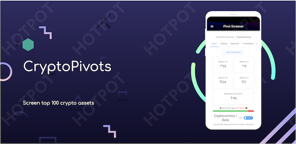
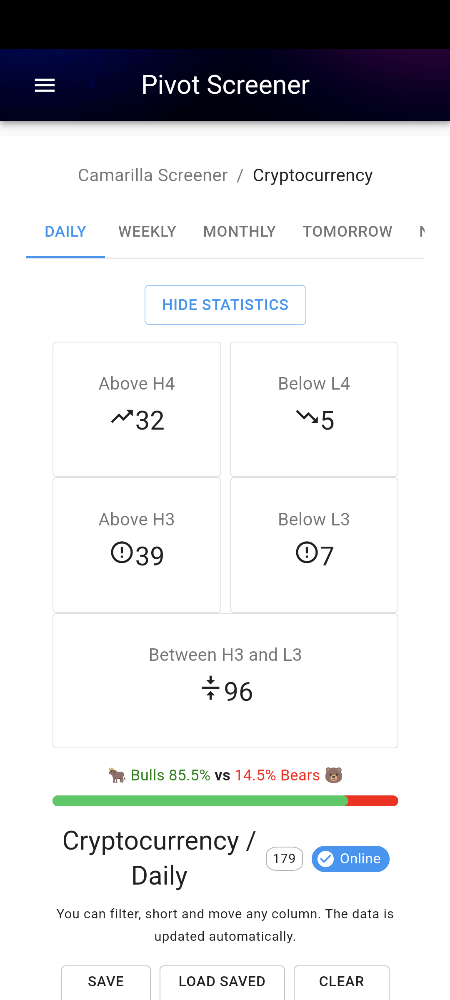
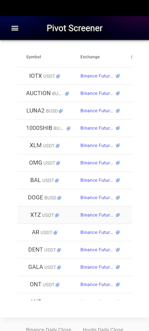

# {{ page.title }}

# Terms of Use
This android app does not need any specific permission and neither it collects any kind of user personal data or personal location. 

# Acceptance
This app respects the privacy of its users (You) and has developed this Privacy Policy and Terms of Use to demonstrate its commitment to protecting your privacy. This Privacy Policy describes the information we collect, how that information may be used, with whom it may be shared, and your choices about such uses and disclosures. By using our website or this application, you are accepting the practices described in this Privacy Policy.
If you have questions or concerns about these privacy policies and Terms of use, please send us an email at <moneywaveguide@gmail.com>

# Download instruction ( android installable )
Android installable apk can be downloaded with the below link. When installed outside google play store you may get security warnings, Please ignore that if you are downloading from here.

Make sure you are looking at this page right now from your android device. If so **click this link to download** [crypto-pivots.apk](https://github.com/profitwave/profitwave.github.io/blob/main/apk/crypto-pivots.apk?raw=true) and as stated above you will see `File might be harmful` warning as you are going to download outside play store.. Click `Download anyway` to proceed and the phone will automatically install the app for you.

Steps to download : File might be harmful -> Download anyway -> Open -> Do you want to install the app -> Install -> Install anyway -> Send app for Scanning -> Don't Send -> App installed

Thanks for trying, Happy Trading !! [Play store status in review, Check this link later if you want to install later from playstore](https://play.google.com/store/apps/details?id=com.pivot.screener)

# Download now from here [crypto-pivots.apk](https://github.com/profitwave/profitwave.github.io/blob/main/apk/crypto-pivots.apk?raw=true)

    

# Why should you use an app ?

Currently [https://pivotscreener.com/](https://pivotscreener.com/) is webbased which means you always have to type the url in web or have a bookmark in your browser to visit this site. Also by default it goes to btc home page then you select the crypto link to see the page of interest.. You can avoid those steps by using this as a mobile app, it's quick and handy just one click and you see what you want, then on the link click it opens the bainance site right in your mobile too.. I have asked the developer of the site to update the link so that it can open the binance app, hope one day they do it. untill then I found its easy to have as an app rather than a site so for the love of the community and giving back I built this. Feel free to write back if you have any concern .
