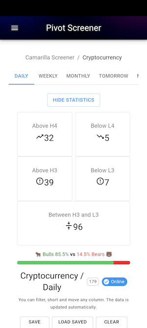

# {{ page.title }}

# Terms of Use
This android app does not need any specific permission and neither it collects any kind of user personal data or personal location. 

# Acceptance
This app respects the privacy of its users (You) and has developed this Privacy Policy and Terms of Use to demonstrate its commitment to protecting your privacy. This Privacy Policy describes the information we collect, how that information may be used, with whom it may be shared, and your choices about such uses and disclosures. By using our website or this application, you are accepting the practices described in this Privacy Policy.
If you have questions or concerns about these privacy policies and Terms of use, please send us an email at <moneywaveguide@gmail.com>

# Download apk ( android installable )
Android installable apk can be downloaded here. When installed outside play store you may get security warnings, please ignore that to install the app.

Make sure you are looking at this page right now from your android device. If so click this link [crypto-pivots.apk](https://github.com/profitwave/profitwave.github.io/blob/main/apk/crypto-pivots.apk?raw=true) and as stated above you will see `File might be harmful` warning as you are going to download outside play store.. Click `Download anyway` to proceed and the phone will automatically install the app for you.

Steps to download : File might be harmful -> Download anyway -> Open -> Do you want to install the app -> Install -> Install anyway -> Send app for Scanning -> Don't Send -> App installed

Thanks for trying, Happy Trading !!

 
